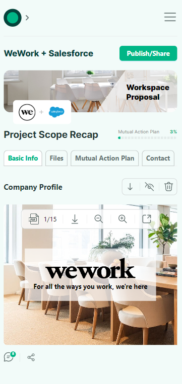

# Dealintent

## Table of contents

-   [Overview](#overview)
    -   [Screenshot](#screenshot)
    -   [Links](#links)
-   [Technologies Used](#technologies-used)
-   [Installation](#installation)
-   [Usage](#usage)
-   [Author](#author)

## Overview

### Screenshot





### Links

-   Live Site URL: []()

### Technologies Used

-   Next.js
-   React
-   SASS
-   Typescript
-   Ant-designs

### Installation

To run this project locally, follow these steps:

1. Clone the repository:

```
git clone https://github.com/vishwa-akshat/dealintent.git

```

2. Navigate to the project directory:

```
cd dealintent

```

3. Install the dependencies using npm or yarn:

```
npm install
# or
yarn install

```

### Usage

To start the development server, run:

```
npm run dev
# or
yarn dev
```

This will start the app in development mode. Open your browser and navigate to http://localhost:3000 to see the app.

## Author

-   Website - [Akshat Vishwakarma](https://akshat-dev.vercel.app/)
-   Twitter - [@akshatVis](https://twitter.com/akshatVis)
